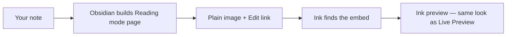

# Reading mode

## Why it exists

Obsidian has two main ways to look at a note while you are editing.

**Live Preview** is where you type. Ink draws your writing and drawing embeds with its own editor widgets — sizing, frames, and preview layout all work there.

**Reading mode** is where you read the note without editing. Obsidian builds the page itself. By default it only knows how to show a normal image embed plus an Edit link. Ink would look wrong: wrong size, wrong frame, no guide lines, and colours that do not follow your theme.

Reading mode exists so Ink embeds look the same as they do in Live Preview preview — but read-only.

## Conceptual understanding

When you switch to Reading mode, Obsidian renders your note first. For each Ink embed it outputs a simple image block and an Edit link on the next line.

Ink watches that output. When it finds an Ink writing or drawing embed (image + matching Edit link), it removes that block and puts its own preview in the same place. The preview is the same component used in Live Preview when the embed is locked — just without click-to-edit.

Size and layout come from the **Edit link**, not from the image line. The link stores width, aspect ratio, and (for drawings) which part of the canvas to show. Reading mode reads those settings and applies them.

Reading mode embeds are **display only**. You cannot tap them to edit. Use Live Preview or open the ink file to change strokes.

## Flows

1. You open a note in Reading mode.
2. Obsidian renders markdown into HTML — image embed and Edit link appear together.
3. Ink scans each paragraph (and similar blocks) for Ink embeds.
4. Ink checks the Edit link to learn embed type, size, and framing.
5. Ink loads the SVG file from your vault.
6. Ink replaces the plain image block with its preview component.
7. The preview inlines the SVG and applies theme colours (see [Ink colours and theming](ink-colours-and-theming.md)).

Ink waits until the full block is on the page before replacing it. The Edit link must already exist next to the image, or Ink cannot pair them.

## Technical details

| Topic | What happens |
|-------|----------------|
| Detection | Ink looks for `InkWriting` or `InkDrawing` alt text on an embed, plus a nearby Edit link with `type=inkWriting` or `type=inkDrawing` in the URL. |
| File path | Taken from the embed’s `src` when possible. Nested images inside Obsidian’s embed wrapper use the wrapper’s vault path. |
| Drawing size | Width from settings, capped to the note column; height from aspect ratio; optional viewBox crop from settings. |
| Writing size | Full column width; height from aspect ratio. |
| Full-bleed drawings | Reading mode can extend drawing embeds edge-to-edge in the preview column, same as Live Preview. |
| PDF export | Same preview layout and drawing reframing as Reading mode — via the reading-mode post-processor on Obsidian’s print DOM. See [Reading mode embed rendering — PDF export](reading-mode-embed-rendering.md#pdf-export). |

For implementation file paths and design alternatives, see [Reading mode embed rendering](reading-mode-embed-rendering.md).

## Technical gotchas

1. **Two render paths** — CodeMirror widgets run in Live Preview only. Reading mode needs its own Ink step after Obsidian renders markdown.
2. **Image tag vs inlined SVG** — A plain `` tag cannot be recoloured by Ink’s theme CSS. Reading mode must swap to an inlined SVG preview.
3. **Edit link is required** — An image without the matching Edit link is treated as a normal attachment, not an Ink embed.
4. **Timing** — Ink replaces embeds after the paragraph is complete. Partial renders during page build are skipped until the block is ready.
5. **Same file, many notes** — Path resolution uses the note that contains the embed, not whichever file you have focused.
6. **PDF export** — Uses the same reading-mode preview path as on-screen Reading mode, not Live Preview. Reframes and embed sizing export correctly when the post-processor runs on Obsidian’s print DOM. See [Reading mode embed rendering — PDF export](reading-mode-embed-rendering.md#pdf-export).

## See also

- [Ink colours and theming](ink-colours-and-theming.md) — How stroke and line colours follow light/dark theme
- [Reading mode embed rendering](reading-mode-embed-rendering.md) — Implementation detail and design choices
- [Ink embeds: contexts and limitations](ink-embeds-contexts-and-limitations.md) — Where embeds work across Obsidian views
