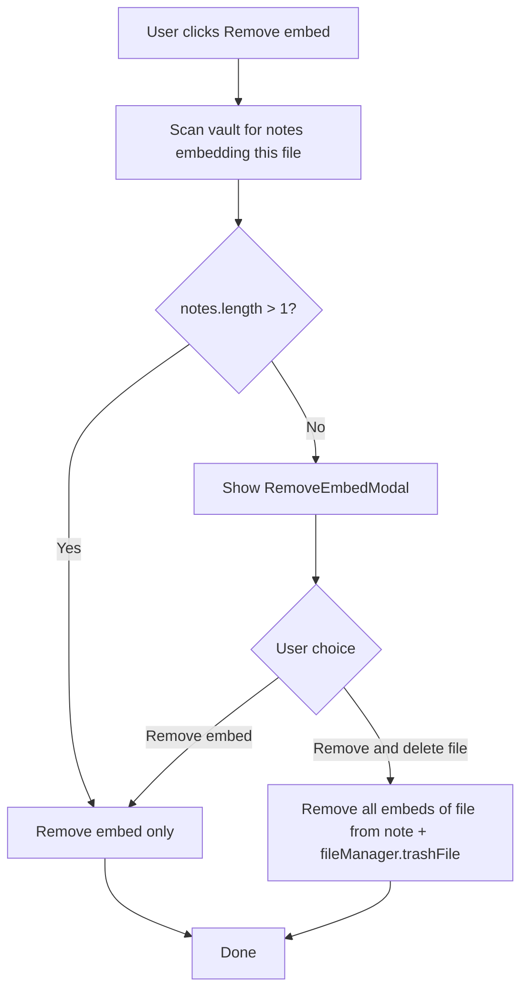

# Remove embed

## Why it exists

When a user removes an ink embed from a note, the referenced SVG file may still exist in the vault. If that file is embedded nowhere else, the user may want to delete it to avoid orphaned files. This doc describes how the plugin offers that choice.

## Conceptual overview

The remove-embed flow scans the vault to see whether the embedded file is referenced in any other notes. If it is, the embed is removed without prompting — the file stays. If it is only in the current note, a modal asks whether to remove only the embed or also delete the file from the vault.

## Flow



- **File embedded in multiple notes** — Remove embed only, no prompt. The file remains for other notes.
- **File embedded only in current note** — Modal with two options: "Remove embed" or "Remove and delete file".
- **"Remove embed"** — Removes this embed from the note via the CodeMirror widget (same as before). The file stays.
- **"Remove and delete file"** — Removes all embeds of that file from the current note (including when the same file is embedded multiple times), then deletes the file from the vault.

## Technical implementation details

| Layer | File | Responsibility |
|-------|------|---------------|
| Flow | `logic/utils/remove-embed-flow.ts` | `openRemoveEmbedFlow()` — opens modal and wires callbacks |
| Modal | `modals/remove-embed-modal/remove-embed-modal.ts` | Scans vault, shows progress, presents two buttons when file is only in current note |
| Utility | `logic/utils/convert-file-embeds.ts` | `findNotesContainingFileEmbed()`, `removeAllEmbedsOfFileFromNote()` |
| Embeds | `drawing-embed.tsx`, `writing-embed.tsx` | "Remove embed" action calls `openRemoveEmbedFlow` instead of `props.remove()` directly |

Scope: **current format only** (`formats/current/`). The v1 format keeps the original remove behaviour.

## Testing

The remove-embed feature has unit and e2e tests.

**Unit tests**

- `convert-file-embeds` (`ConvertFileEmbeds.test.ts`): `removeAllEmbedsOfFileFromNote` isolation — embed removed, other content preserved, other embeds untouched, `vault.modify` called once.
- `remove-embed-flow` (`remove-embed-flow.test.ts`): `openRemoveEmbedFlow` modal wiring, callbacks, correct file deleted.
- `RemoveEmbedModal` (`remove-embed-modal.test.ts`): Scan phase, notes > 1 vs = 1, button handlers, cancel, error handling.
- `DrawingEmbed` / `WritingEmbed`: Remove embed calls `openRemoveEmbedFlow` vs fallback when `sourceMdFile` is missing.

**E2E tests**

- `remove-embed-modal.e2e.ts`: Full user flow — modal scan → confirm, multi-note (no modal), "Remove embed", "Remove and delete file", cancel, drawing flows, file in two notes. Overflow menu tests (7, 8) are skipped because the Obsidian Menu DOM is not reliably findable in e2e; flow coverage is via programmatic tests.

**How to run**

```bash
# Unit
npm test

# E2E (run from obsidian_ink root; generates vault and runs all e2e specs)
npm run test:e2e:spec -- tests/e2e/remove-embed-modal.e2e.ts
```

QA vault section **15 – Remove Embed** provides notes and fixtures for the e2e tests.

## Technical gotchas

- **Same file embedded multiple times in one note**: "Remove and delete file" removes all such embed lines before deleting the file, so no broken references remain.
- **sourceMdFile required**: The flow needs the markdown note containing the embed. If `sourceMdFile` is missing (edge case), the action falls back to immediate removal without the prompt.
- **Obsidian trash**: deletion uses `app.fileManager.trashFile()` so the user’s Obsidian trash-vs-permanent-delete preference is respected (do not use `vault.delete()` for this path).
