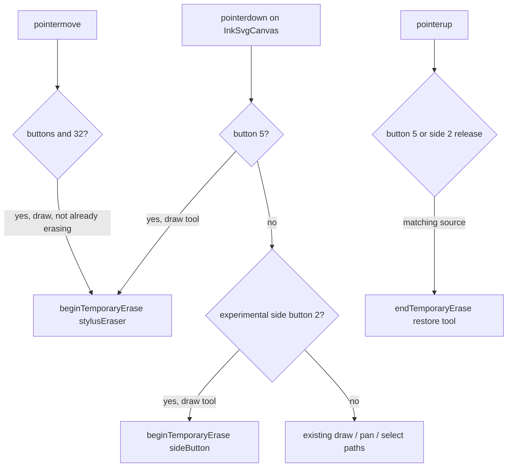

# Stylus eraser input (InkSvgCanvas)

## Why it exists

Users expect graphics-tablet and active-pen workflows where the **eraser end of the stylus** or a **barrel “erase” button** temporarily switches to erase without opening the toolbar. Legacy tldraw-based Ink editors inherited this from tldraw (hardware eraser = Pointer Events `button` 5 / `buttons` 32). The current-format **`InkSvgCanvas`** engine must implement the same contract explicitly.

Related reports: [GitHub #193](https://github.com/daledesilva/obsidian_ink/issues/193) (Wacom regression on Windows after the InkSvgCanvas migration), [GitHub #162](https://github.com/daledesilva/obsidian_ink/issues/162) (side-button erase on Linux / devices that never emit button 5).

---

## Conceptual understanding

| Input | Typical signal | Ink behaviour |
|-------|----------------|---------------|
| **Hardware eraser tip** (Wacom, Surface) | `pointerdown` with `button === 5`; active contact often has `buttons & 32` | **Always on:** temporary erase while contact lasts, then restore prior tool (draw tool only) |
| **Cmd/Ctrl** (desktop) | Keyboard modifier | Temporary erase (unchanged from 0.5.x) |
| **Cmd/Ctrl + left-click** (mouse) | Modifier + primary button | Temporary erase |
| **Double-tap** (experimental) | Two primary taps within 300 ms / 30 px | Toggle draw ↔ erase |
| **Side button** (experimental) | Pen `pointerType: 'pen'`, `button === 2` | Temporary erase while held instead of right-drag pan |

Temporary erase saves the active tool, switches to `erase`, runs the erase tool pointer handlers, then restores the saved tool on release. Only auto-switches when the current tool is **`draw`** (matches tldraw).

---

## Flows

**FingerBlocker** sits above the SVG and must **forward** button-5 events to `.ink-svg-canvas` even when `pointerType` is `mouse` (otherwise Wacom eraser contact is swallowed). See [pen vs finger handling](pen-vs-finger-handling.md).

---

## Technical details

### Detection helpers

[`src/ink-canvas/utils/stylus-eraser-pointer.ts`](../src/ink-canvas/utils/stylus-eraser-pointer.ts):

- `STYLUS_ERASER_POINTER_BUTTON = 5`
- `STYLUS_ERASER_BUTTONS_MASK = 32`
- `isStylusEraserPointerDown`, `isStylusEraserPointerActive`, `isStylusSideButtonPointerDown`

Unit tests: [`tests/ink-canvas/stylus-eraser-pointer.test.ts`](../tests/ink-canvas/stylus-eraser-pointer.test.ts).

### Unified temporary erase (`ink-svg-canvas.tsx`)

`beginTemporaryEraseMode` / `endTemporaryEraseMode` with `temporaryEraseSourceRef`: `'mod' | 'stylusEraser' | 'sideButton'`. Replaces the earlier mod-only temporary-erase refs so all sources share cancel/restore logic and toolbar `subscribeToolChange` updates.

Boox input lock clears any active temporary-erase session (same as mod-key erase).

### Experimental device settings

Stored in device-local `deviceSettings_v1` (not vault `data.json`):

| Field | Default | Settings UI |
|-------|---------|-------------|
| `doubleTapToggleEraser` | `false` | **Experimental changes → Double-tap to toggle eraser** |
| `stylusSideButtonTemporaryErase` | `false` | **Experimental changes → Side button temporary eraser** |

The **Experimental changes** accordion (above **This plugin is in beta** in plugin settings) also holds **Enable Boox companion app**. See [Plugin memory and persistence](plugin-memory-and-persistence.md).

Hooks: `useDoubleTapToggleEraserEnabled`, `useStylusSideButtonTemporaryEraseEnabled`. Reset via **Reset settings** calls `resetExperimentalDeviceSettingsToDefault()` (experimental flags only; Boox has its own reset).

---

## Technical Gotchas

- **Windows + Wacom + Windows Ink** is the well-supported case for button 5. Without Windows Ink, browsers may not emit eraser events at all (see Excalidraw discussion on driver settings).
- **Linux Chromium** often cannot distinguish pen tip vs eraser; Firefox had incorrect button values on some distros. Experimental toggles are the intended fallback on those devices.
- **Samsung S Pen** and similar often map the barrel button to **right-click (`button` 2`)**, not button 5 — use **Side button temporary eraser** (experimental) or **Double-tap to toggle eraser**.
- **Do not** route button-5 through FingerBlocker’s normal draw-forward path (`isDrawingInput`); that would call `drawToolPointerDown` instead of erase.
- **Right-drag pan** on button 2 is preserved when side-button temporary erase is **off**. When on, pen button 2 skips embed pan forwarding and uses temporary erase instead.
- **Legacy tldraw embeds** (v1-code-blocks) still use tldraw’s built-in eraser handling; this document applies to **current-format** `InkSvgCanvas` editors only.
