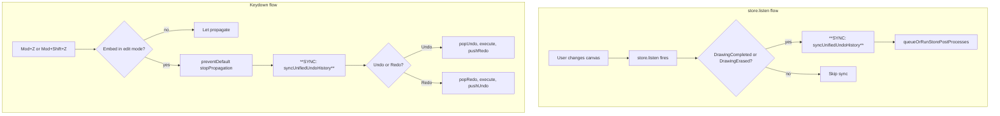
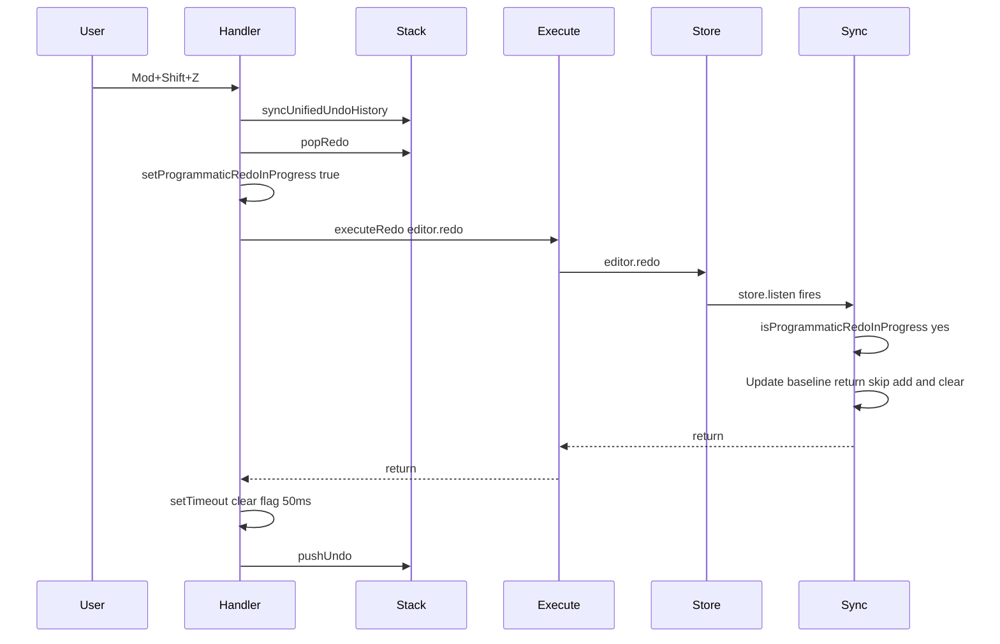
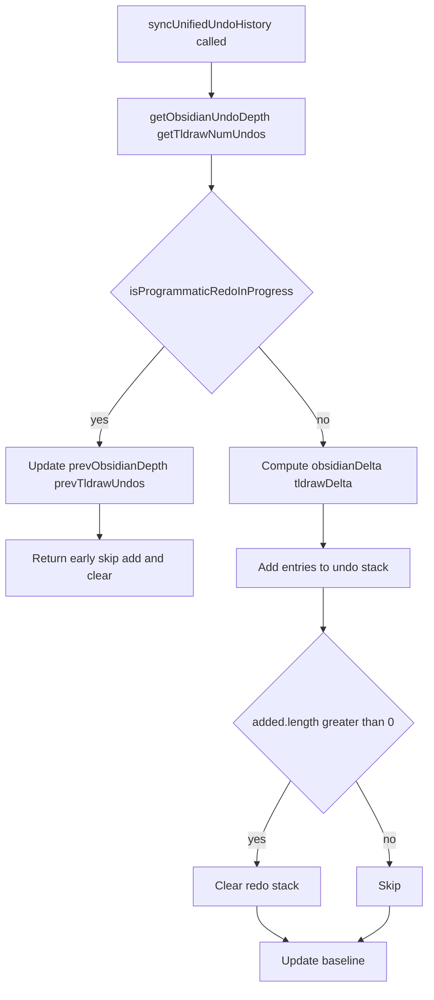
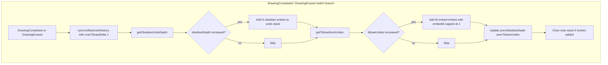
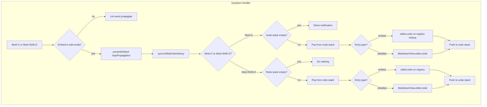

# Undo/Redo Implementation

Technical documentation for the unified undo/redo stack used when ink embeds are in edit mode.

---

## Sync flows overview

The internal undo history is synced in two places:

**1. Switch branches (stroke completed/erased)** — When the user completes a stroke or erases, the store.listen switch hits `DrawingCompleted` or `DrawingErased`. We call `syncUnifiedUndoHistory` with `maxTldrawDelta: 1` just before `queueOrRunStorePostProcesses`. Programmatic undo/redo does not trigger these branches, so the redo stack is not cleared when the user redos.

**2. Keydown (Mod+Z / Mod+Shift+Z)** — Before popping and executing undo/redo, we call `syncUnifiedUndoHistory(activeEmbedId)` to capture any Obsidian edits since the last tldraw action.



---

## Programmatic redo guard

When the user presses Mod+Shift+Z, we call `editor.redo()` on tldraw. That restores shapes and updates the store. tldraw's `store.listen` fires (with `source: 'user'`), the DrawingCompleted/DrawingErased branch runs, and `syncUnifiedUndoHistory` is called. Without a guard, sync would see `getNumUndos()` increased, add an embed entry, and clear the redo stack—wiping the user's ability to redo further.

We use a flag stored on the plugin instance (`plugin.__inkProgrammaticRedoInProgress`). Before `executeRedo`, we set it to `true`; when sync runs and sees it set, we skip adding entries and clearing the redo stack, but still update the baseline. We clear the flag after 50ms via `setTimeout` so any async `store.listen` callback that runs after `editor.redo()` returns still sees it. The keyboard handler passes the plugin explicitly so the flag is set on the same instance that sync reads via `getGlobals().plugin`.

### Redo flow with guard (sequence)



### Sync decision tree with guard



---

## Files and modules

| File | Purpose |
|------|---------|
| `src/logic/undo-redo/unified-undo-stack.ts` | Custom undo/redo stack state and sync logic |
| `src/logic/undo-redo/ink-editor-registry.ts` | Map of embedId → tldraw Editor; register/unregister on mount |
| `src/logic/undo-redo/obsidian-undo-depth.ts` | Helper to get CodeMirror `undoDepth(state)` from active MarkdownView |
| `src/logic/undo-redo/keyboard-handler.ts` | Global keydown handler for Mod+Z and Mod+Shift+Z |

**Wiring points:**
- `TldrawWritingEditor.handleMount` / `TldrawDrawingEditor.handleMount` — register editor, store.listen calls sync just before `queueOrRunStorePostProcesses` in DrawingCompleted/DrawingErased branches
- `main.ts` — call `registerUnifiedUndoRedo(plugin)` on load when writing/drawing enabled

---

## Data flow

### Sync (when stroke completed or erased)

`syncUnifiedUndoHistory` runs just before `queueOrRunStorePostProcesses` in the `DrawingCompleted` and `DrawingErased` switch branches. We use `maxTldrawDelta: 1` so each stroke produces one embed entry. Programmatic `editor.undo()` / `editor.redo()` do not trigger these branches, so the redo stack is not cleared when the user redos.



### Keydown (Mod+Z / Mod+Shift+Z)

The handler syncs before undo and redo to capture any Obsidian changes that occurred without a tldraw store event (e.g. user typed in markdown while the embed was in edit mode).



---

## API surface

### unified-undo-stack.ts

```typescript
type UnifiedUndoEntry =
  | { type: 'embed'; embedId: string }
  | { type: 'obsidian' };

function initialize(obsidianDepth: number, tldrawUndos: number): void;
function syncUnifiedUndoHistory(embedId: string, options?: { maxTldrawDelta?: number }): void;
// Fetches plugin from getGlobals(), editor from getEditor(embedId); returns early if no editor.
function popUndo(): UnifiedUndoEntry | null;
function pushRedo(entry: UnifiedUndoEntry): void;
function popRedo(): UnifiedUndoEntry | null;
function pushUndo(entry: UnifiedUndoEntry): void;
function isUndoStackEmpty(): boolean;
```

### ink-editor-registry.ts

```typescript
function register(embedId: string, editor: Editor, containerEl: HTMLElement): void;
function unregister(embedId: string): void;
function getEditor(embedId: string): Editor | undefined;
function getActiveEmbedId(): string | null;  // from embed state atoms
```

### obsidian-undo-depth.ts

```typescript
function getObsidianUndoDepth(plugin: InkPlugin): number;
function getObsidianRedoDepth(plugin: InkPlugin): number;  // for completeness
```

### Initialization sequence

1. User clicks embed to edit → `embedStateAtom` / `embedStateAtom_v2` → `editor`
2. `TldrawWritingEditor` / `TldrawDrawingEditor` mounts, `handleMount` runs
3. In `handleMount`: call `initialize(getObsidianUndoDepth(plugin), getTldrawNumUndos(editor))`
4. Register editor in registry with `embedId`
5. Add store.listen that calls sync just before `queueOrRunStorePostProcesses` in DrawingCompleted/DrawingErased branches
6. On unmount: unregister from registry

---

## Integration points

| Location | Action |
|----------|--------|
| `WritingEmbedWidget` / `DrawingEmbedWidget` | Pass `widget.id` as `embedId` to WritingEmbed / DrawingEmbed |
| `WritingEmbed` / `DrawingEmbed` | Pass `embedId` to TldrawWritingEditor / TldrawDrawingEditor |
| `TldrawWritingEditor.handleMount` | Initialize stack, register editor; sync just before queueOrRunStorePostProcesses in DrawingCompleted/DrawingErased branches |
| `TldrawDrawingEditor.handleMount` | Same as writing |
| `main.ts onload` | Call `registerUnifiedUndoRedo(plugin)` when writing or drawing enabled |

### embedId source

The widget (`WritingEmbedWidget` / `DrawingEmbedWidget`) has `this.id` from `crypto.randomUUID()`. This is passed down as `embedId` so the same instance is consistently identified. The registry and stack use this id.

### Edit-mode check

The keyboard handler checks `embedStateAtom` (writing) and `embedStateAtom_v2` (drawing). If either indicates `editor` state, an embed is in edit mode and we capture the key.

---

## Dependencies

- **@codemirror/commands**: `undoDepth(state)`, `redoDepth(state)`. Added as devDependency for types; runtime uses Obsidian's bundled version (external in esbuild).
- **Obsidian Editor**: `editor.undo()`, `editor.redo()` on MarkdownView's editor.
- **tldraw Editor**: `editor.undo()`, `editor.redo()`. Undo count via `(editor as any).history?.getNumUndos?.()`.

---

## Technical gotchas

### Programmatic undo/redo and sync placement

Sync runs just before `queueOrRunStorePostProcesses` in the `DrawingCompleted` and `DrawingErased` switch branches. When we call `editor.redo()`, tldraw restores shapes and `store.listen` fires—so sync *does* run during redo. Without a guard, that sync would add entries and clear the redo stack. We use `isProgrammaticRedoInProgress` (see Programmatic redo guard below). For Obsidian: we have no separate Obsidian listener; we only sync from these branches or keydown. Our undo decreases Obsidian's undoDepth, so we only add when depth *increases*.

### Programmatic saves

`props.save()` in `completeSave` and `incrementalSave` writes to the embedded file via `vault.modify`; it does not modify the markdown. So no programmatic Obsidian change occurs and no mitigation is needed.

For the keydown handler: we set a flag before calling Obsidian undo/redo if we ever add an Obsidian-side listener in the future. Currently not required.

### Obsidian editor availability

`plugin.app.workspace.getActiveViewOfType(MarkdownView)?.editor` can be null if:
- No markdown note is focused
- The user switched to a different leaf

When null, we treat undo depth as 0. The handler should not crash.

### tldraw history access

`Editor.history` is protected. We use `(editor as any).history?.getNumUndos?.() ?? 0`. This is brittle if tldraw changes its API but is the only way to get the count without a public API.

### Embed state atoms

Writing uses `embedStateAtom`; drawing uses `embedStateAtom_v2`. Both use a single global atom, so only one embed is in edit mode at a time across the app. The keyboard handler must check both when deciding whether to capture.

### Two tldraw history marks per logical action

tldraw creates two history marks per draw stroke: one when the shape is added to the store, another when `isComplete` is set to true. We only sync on completion-level activities (e.g. `DrawingCompleted`), so we sync once per stroke—but at that moment `getNumUndos()` has already increased by 2, yielding `tldrawDelta = 2`. Without mitigation, we would add two embed entries per stroke. We cap `tldrawDelta` to 1 for `DrawingCompleted` and `DrawingErased` via `syncUnifiedUndoHistory(..., { maxTldrawDelta: 1 })`, so each stroke produces one embed entry. The keydown handler does not pass this option so all pending tldraw changes are synced before undo/redo.

### Programmatic redo guard

When we call `editor.redo()`, tldraw restores shapes and `store.listen` fires with `source: 'user'`. The sync in the DrawingCompleted/DrawingErased branches would see an increased `getNumUndos()`, add entries, and clear the redo stack—wiping the user's ability to redo further. tldraw's history mark count per redo is not reliably 1 or 2, so we use a flag instead.

**Flag storage:** Stored on the plugin instance (`plugin.__inkProgrammaticRedoInProgress`) so it is shared even if the build produces multiple module instances. The keyboard handler passes the plugin explicitly: `setProgrammaticRedoInProgress(true, plugin)`.

**Timing:** We set the flag before `executeRedo`. We clear it with `setTimeout(..., 50)` in a `finally` block—`store.listen` may run asynchronously (e.g. in a macrotask) after `editor.redo()` returns, so the 50ms delay keeps the flag true long enough for that sync to see it and skip.

**When the flag is set:** Sync updates the baseline (`prevObsidianDepth`, `prevTldrawUndos`) and returns early—no entries added, redo stack not cleared.

---

## Testing

### Unit tests

- **unified-undo-stack.test.ts** — Tests `initialize`, stack operations (pop/push), `syncUnifiedUndoHistory` with mocked dependencies, `notifyUndoExecuted`/`notifyRedoExecuted` baseline adjustments, and the programmatic redo guard.
- **keyboard-handler.test.ts** — Tests keydown handling: early return when no active embed, undo/redo flow with mocked stack, programmatic redo flag set/clear timing, and Ctrl+Z (Windows/Linux) support.

### E2E tests

- **undo-redo.e2e.ts** — Tests undo/redo in the live Obsidian environment:
  - One embed: embed-only actions (undo twice, redo twice, correct order); mixed embed + Obsidian; programmatic redo guard (redo twice preserves redo stack).
  - Two embeds: interleaved (stroke in embed 1, lock, stroke in embed 2, undo/redo for embed 2); mixed usage (draw E1, E2, E1, E2, assert undo/redo affects correct embeds); mixed with Obsidian (alternate typing and drawing across embeds); mid-sequence lock (skipped until purge-on-lock is implemented).
  - Three embeds: mixed usage (draw E1, E2, E3, E1, E2, E3, assert undo/redo affects correct embeds).

Vault notes: `11 - CodeMirror and Editor Behavior/Undo Redo One Embed.md`, `Undo Redo Two Embeds.md`, `Undo Redo Three Embeds.md` (empty writing embeds with surrounding text).

### E2E technical gotchas

- **Tldraw mount timing:** Tests wait for `.tl-container` before any interaction; the editor ref is set in `handleMount`, so `findTldrawEditor()` returns null until then. An extra 1000ms settle after the wait allows opacity and registry setup to complete.
- **Focus before undo/redo:** `focusTldrawCanvas()` focuses `.tl-container` before sending Cmd+Z / Cmd+Shift+Z so the keyboard handler receives the event (Obsidian’s editor may otherwise capture it).
- **Lock button:** The editor starts with `opacity: 0` until `handleMount`; WebDriver may treat the lock button as not interactable. Tests use a JS click (`browser.execute`) to bypass interactability checks.
- **Preview click in multi-embed:** WebDriver click on previews inside CodeMirror widgets can be unreliable. Tests use `browser.execute` with `querySelectorAll` to click the preview by index.
- **Lock+switch flow:** Use `clickLockAndWait` (waits for editor to unmount) before `clickUnlockByIndex` when switching embeds, so the transition completes before activating the next embed.
- **Per-embed assertions:** Only one embed is in edit mode at a time. Tests use `getShapeCountInEmbed(embedIndex)` to switch to that embed and read its shape count before asserting.

### E2E technical gotchas

- **Tldraw mount timing:** Tests wait for `.tl-container` before interacting; the editor ref is set in `handleMount`, so `findTldrawEditor` (React fiber traversal) needs the TldrawEditor to be mounted.
- **Focus before undo/redo:** The keyboard handler runs when Cmd/Ctrl+Z is pressed. Tests call `focusTldrawCanvas()` before `sendUndo`/`sendRedo` so the tldraw canvas receives focus and our handler runs instead of Obsidian’s.
- **Lock button:** The editor starts with `opacity: 0` until `handleMount`; WebDriver may treat the lock button as not interactable. Tests use a JS click via `browser.execute` to bypass interactability checks.
- **Preview click in multi-embed notes:** WebDriver clicks on previews inside CodeMirror widgets can be unreliable. Tests use `browser.execute` with `querySelectorAll` to click the preview by index.
- **Lock+switch flow:** When locking then switching to another embed, tests use `clickLockAndWait` to wait for the editor to unmount before clicking the next preview.

### E2E technical gotchas

- **Tldraw mount timing:** The test waits for `.tl-container` before any interaction; the editor ref is set in `handleMount`, which runs when TldrawEditor mounts. Without this wait, `findTldrawEditor()` returns null and `createStroke` fails.
- **Focus before undo/redo:** The tldraw canvas is focused before sending Cmd+Z / Cmd+Shift+Z so the plugin's keydown handler receives the event; otherwise Obsidian's editor may capture it.
- **Lock button:** WebDriver can treat the lock button as not interactable when the editor wrapper has `opacity: 0` during load. The test uses a JS click via `browser.execute` to bypass interactability checks.
- **Preview click in multi-embed:** WebDriver click on previews inside CodeMirror widgets can be unreliable. The test uses `browser.execute` with `querySelectorAll` to click the preview by index.
- **Lock+switch flow:** Use `clickLockAndWait` (waits for editor to unmount) before `clickUnlockByIndex` when switching embeds, so the transition completes before activating the next embed.

### E2E technical gotchas

- **Tldraw mount timing:** The test waits for `.tl-container` before any interaction; the editor ref is set in `handleMount`, which runs when TldrawEditor mounts. Without this wait, `findTldrawEditor()` returns null and `createStroke` fails.
- **Focus before undo/redo:** `focusTldrawCanvas()` focuses `.tl-container` before sending Cmd+Z / Cmd+Shift+Z so the keyboard handler receives the event (Obsidian's editor may otherwise capture it).
- **Lock button:** The editor wrapper starts with `opacity: 0` until `handleMount`; WebDriver may treat the lock button as not interactable. The test uses a JS click via `browser.execute` to bypass this.
- **Preview click in multi-embed notes:** WebDriver click on previews inside CodeMirror widgets can be unreliable. The test uses `browser.execute` to find and click the preview by index.
- **Lock+switch flow:** Use `clickLockAndWait` (waits for editor to unmount) before `clickUnlockByIndex` when switching between embeds.

### E2E technical gotchas

- **Tldraw mount timing:** The test waits for `.tl-container` before interacting; the editor ref is set in `handleMount`, so `findTldrawEditor` needs the tldraw component to be mounted.
- **Focus before undo/redo:** `focusTldrawCanvas()` focuses `.tl-container` before sending Cmd+Z so the keyboard handler receives the event.
- **Lock button:** WebDriver can treat the lock button as not interactable when the editor has `opacity: 0`; the test uses a JavaScript click to bypass this.
- **Preview click in CodeMirror:** Clicking previews inside CodeMirror widgets can be unreliable; the test uses `browser.execute` to click the preview by index.

### E2E technical gotchas

- **Editor readiness:** Tests wait for `.tl-container` before `createStroke`; the tldraw ref is set in `handleMount`. A 1s settle after the wait allows opacity and registry to complete.
- **Focus:** `sendUndo`/`sendRedo` focus `.tl-container` before sending keys so the plugin handler receives Cmd+Z.
- **Lock button:** JS click is used to bypass WebDriver interactability checks when the editor parent has `opacity: 0` during load.
- **Preview click:** JS click via `querySelectorAll` is used for unlocking embeds; WebDriver click can be unreliable on previews inside CodeMirror.

### Limitations

- **Undo of locked-embed actions:** When an embed is locked it is unregistered. Undo of that embed's actions requires unlocking it again; at that moment the previously active embed locks. The implementation uses `getEditor(entry.embedId)` — if the embed is locked, it returns undefined and the undo is a no-op for that entry.

### E2E technical gotchas

- **Tldraw mount timing:** The test waits for `.tl-container` before interactions; the editor ref is set in `handleMount`, so `findTldrawEditor()` needs the TldrawEditor to be mounted. An extra settle pause (e.g. 1000ms) after the wait helps.
- **Focus for keyboard events:** Cmd+Z / Cmd+Shift+Z must reach the plugin handler. Tests use synthetic `KeyboardEvent` dispatch on `document` instead of `browser.keys()` because WebDriver's modifier-key combos (e.g. Cmd+Shift+Z) can be unreliable.
- **Shape-count assertions:** Use `waitForShapeCount` (polling) instead of fixed pauses. Programmatic `createShape` can batch differently than manual drawing, so One Embed tests use `waitForShapeCountOneOf` to accept variance (e.g. [0, 1] after two undos).
- **Lock button:** The editor starts with `opacity: 0` until `handleMount`; WebDriver may treat the lock button as not interactable. The test uses `browser.execute` to click it via JavaScript.
- **Preview click in multi-embed notes:** WebDriver click on previews inside CodeMirror can be unreliable. The test uses `browser.execute` with `querySelectorAll` to click the preview by index.

### E2E technical gotchas

- **Tldraw readiness:** The test waits for `.tl-container` before any interaction; the editor ref is only set in `handleMount`, so `findTldrawEditor()` returns null until tldraw has mounted. An extra settle pause (1s) after the wait allows handleMount to complete.
- **Focus:** `sendUndo`/`sendRedo` focus the tldraw canvas before sending keys so the plugin's keydown handler receives Cmd+Z instead of Obsidian's editor.
- **Lock button:** WebDriver can report "element not interactable" when the editor wrapper has `opacity: 0` during load. The test uses a JavaScript click to bypass interactability checks.
- **Preview click:** Clicking previews inside CodeMirror widgets can be unreliable; the test uses `browser.execute` to find and click the preview by index.

### E2E technical gotchas

- **Tldraw readiness:** The test waits for `.tl-container` before any interaction; the editor ref is set in `handleMount` and is required for `findTldrawEditor()` to locate the tldraw Editor.
- **Focus:** `sendUndo`/`sendRedo` focus the tldraw canvas before sending keys so the plugin's keydown handler receives Cmd+Z instead of Obsidian's editor.
- **Lock button:** WebDriver can treat the lock button as not interactable when the editor wrapper has `opacity: 0` during load. The test uses a JS click via `browser.execute` to bypass interactability checks.
- **Preview click:** Clicking previews inside CodeMirror widgets can be unreliable; the test uses `browser.execute` to find and click the preview by index.
