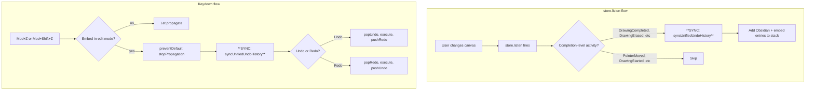
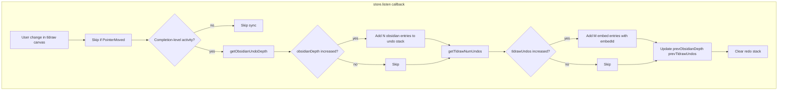
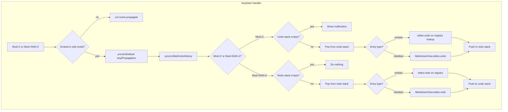

# Undo/Redo Implementation

Technical documentation for the unified undo/redo stack used when ink embeds are in edit mode.

---

## Sync flows overview

The internal undo history is synced in two places:

**1. store.listen (canvas changes)** — When the user changes the canvas (stroke, erase, camera move), we call `syncUnifiedUndoHistory` for completion-level activities, with `maxTldrawDelta: 1` for draw/erase so each stroke adds one entry.

**2. Keydown (Mod+Z / Mod+Shift+Z)** — Before popping and executing undo/redo, we call `syncUnifiedUndoHistory(activeEmbedId)` to capture any Obsidian edits since the last tldraw action.



---

## Files and modules

| File | Purpose |
|------|---------|
| `src/logic/undo-redo/unified-undo-stack.ts` | Custom undo/redo stack state and sync logic |
| `src/logic/undo-redo/ink-editor-registry.ts` | Map of embedId → tldraw Editor; register/unregister on mount |
| `src/logic/undo-redo/obsidian-undo-depth.ts` | Helper to get CodeMirror `undoDepth(state)` from active MarkdownView |
| `src/logic/undo-redo/keyboard-handler.ts` | Global keydown handler for Mod+Z and Mod+Shift+Z |

**Wiring points:**
- `TldrawWritingEditor.handleMount` / `TldrawDrawingEditor.handleMount` — register editor, sync in store.listen
- `main.ts` — call `registerUnifiedUndoRedo(plugin)` on load when writing/drawing enabled

---

## Data flow

### Sync (when tldraw store fires)

`syncUnifiedUndoHistory` runs **only on completion-level activities** to avoid duplicate entries per stroke. `store.listen` fires for `DrawingStarted`, `DrawingContinued`, and `DrawingCompleted`; we sync only on `DrawingCompleted`, `DrawingErased`, `CameraMovedManually`, `CameraMovedAutomatically`, and `Unclassified`. This ensures one logical stroke produces one embed entry.



### Keydown (Mod+Z / Mod+Shift+Z)

The handler syncs before undo and redo to capture any Obsidian changes that occurred without a tldraw store event (e.g. user typed in markdown while the embed was in edit mode).



---

## API surface

### unified-undo-stack.ts

```typescript
type UnifiedUndoEntry =
  | { type: 'embed'; embedId: string }
  | { type: 'obsidian' };

function initialize(obsidianDepth: number, tldrawUndos: number): void;
function syncUnifiedUndoHistory(embedId: string, options?: { maxTldrawDelta?: number }): void;
// Fetches plugin from getGlobals(), editor from getEditor(embedId); returns early if no editor.
function popUndo(): UnifiedUndoEntry | null;
function pushRedo(entry: UnifiedUndoEntry): void;
function popRedo(): UnifiedUndoEntry | null;
function pushUndo(entry: UnifiedUndoEntry): void;
function isUndoStackEmpty(): boolean;
```

### ink-editor-registry.ts

```typescript
function register(embedId: string, editor: Editor, containerEl: HTMLElement): void;
function unregister(embedId: string): void;
function getEditor(embedId: string): Editor | undefined;
function getActiveEmbedId(): string | null;  // from embed state atoms
```

### obsidian-undo-depth.ts

```typescript
function getObsidianUndoDepth(plugin: InkPlugin): number;
function getObsidianRedoDepth(plugin: InkPlugin): number;  // for completeness
```

### Initialization sequence

1. User clicks embed to edit → `embedStateAtom` / `embedStateAtom_v2` → `editor`
2. `TldrawWritingEditor` / `TldrawDrawingEditor` mounts, `handleMount` runs
3. In `handleMount`: call `initialize(getObsidianUndoDepth(plugin), getTldrawNumUndos(editor))`
4. Register editor in registry with `embedId`
5. Add store.listen that calls `syncUnifiedUndoHistory` on user changes
6. On unmount: unregister from registry

---

## Integration points

| Location | Action |
|----------|--------|
| `WritingEmbedWidget` / `DrawingEmbedWidget` | Pass `widget.id` as `embedId` to WritingEmbed / DrawingEmbed |
| `WritingEmbed` / `DrawingEmbed` | Pass `embedId` to TldrawWritingEditor / TldrawDrawingEditor |
| `TldrawWritingEditor.handleMount` | Initialize stack, register editor, add sync to store.listen |
| `TldrawDrawingEditor.handleMount` | Same as writing |
| `main.ts onload` | Call `registerUnifiedUndoRedo(plugin)` when writing or drawing enabled |

### embedId source

The widget (`WritingEmbedWidget` / `DrawingEmbedWidget`) has `this.id` from `crypto.randomUUID()`. This is passed down as `embedId` so the same instance is consistently identified. The registry and stack use this id.

### Edit-mode check

The keyboard handler checks `embedStateAtom` (writing) and `embedStateAtom_v2` (drawing). If either indicates `editor` state, an embed is in edit mode and we capture the key.

---

## Dependencies

- **@codemirror/commands**: `undoDepth(state)`, `redoDepth(state)`. Added as devDependency for types; runtime uses Obsidian's bundled version (external in esbuild).
- **Obsidian Editor**: `editor.undo()`, `editor.redo()` on MarkdownView's editor.
- **tldraw Editor**: `editor.undo()`, `editor.redo()`. Undo count via `(editor as any).history?.getNumUndos?.()`.

---

## Technical gotchas

### Programmatic undo guard

When we call `editor.undo()` or `editor.redo()` on Obsidian, that triggers a document change. We do **not** have a separate Obsidian listener; we only sync in store.listen. Our undo decreases Obsidian's undoDepth, so the next store.listen would see a *decrease*, not an increase. We only add when depth *increases*. Therefore we naturally skip recording our own programmatic undos. No explicit guard needed for the sync path.

### Programmatic saves

`props.save()` in `completeSave` and `incrementalSave` writes to the embedded file via `vault.modify`; it does not modify the markdown. So no programmatic Obsidian change occurs and no mitigation is needed.

For the keydown handler: we set a flag before calling Obsidian undo/redo if we ever add an Obsidian-side listener in the future. Currently not required.

### Obsidian editor availability

`plugin.app.workspace.getActiveViewOfType(MarkdownView)?.editor` can be null if:
- No markdown note is focused
- The user switched to a different leaf

When null, we treat undo depth as 0. The handler should not crash.

### tldraw history access

`Editor.history` is protected. We use `(editor as any).history?.getNumUndos?.() ?? 0`. This is brittle if tldraw changes its API but is the only way to get the count without a public API.

### Embed state atoms

Writing uses `embedStateAtom`; drawing uses `embedStateAtom_v2`. Both use a single global atom, so only one embed is in edit mode at a time across the app. The keyboard handler must check both when deciding whether to capture.

### Two tldraw history marks per stroke

tldraw creates two history marks per draw stroke: one when the shape is added to the store, another when `isComplete` is set to true. We only sync on completion-level activities (e.g. `DrawingCompleted`), so we sync once per stroke—but at that moment `getNumUndos()` has already increased by 2, yielding `tldrawDelta = 2`. Without mitigation, we would add two embed entries per stroke. We cap `tldrawDelta` to 1 for `DrawingCompleted` and `DrawingErased` via `syncUnifiedUndoHistory(..., { maxTldrawDelta: 1 })`, so each stroke produces one embed entry. The keydown handler does not pass this option so all pending tldraw changes are synced before undo/redo.
