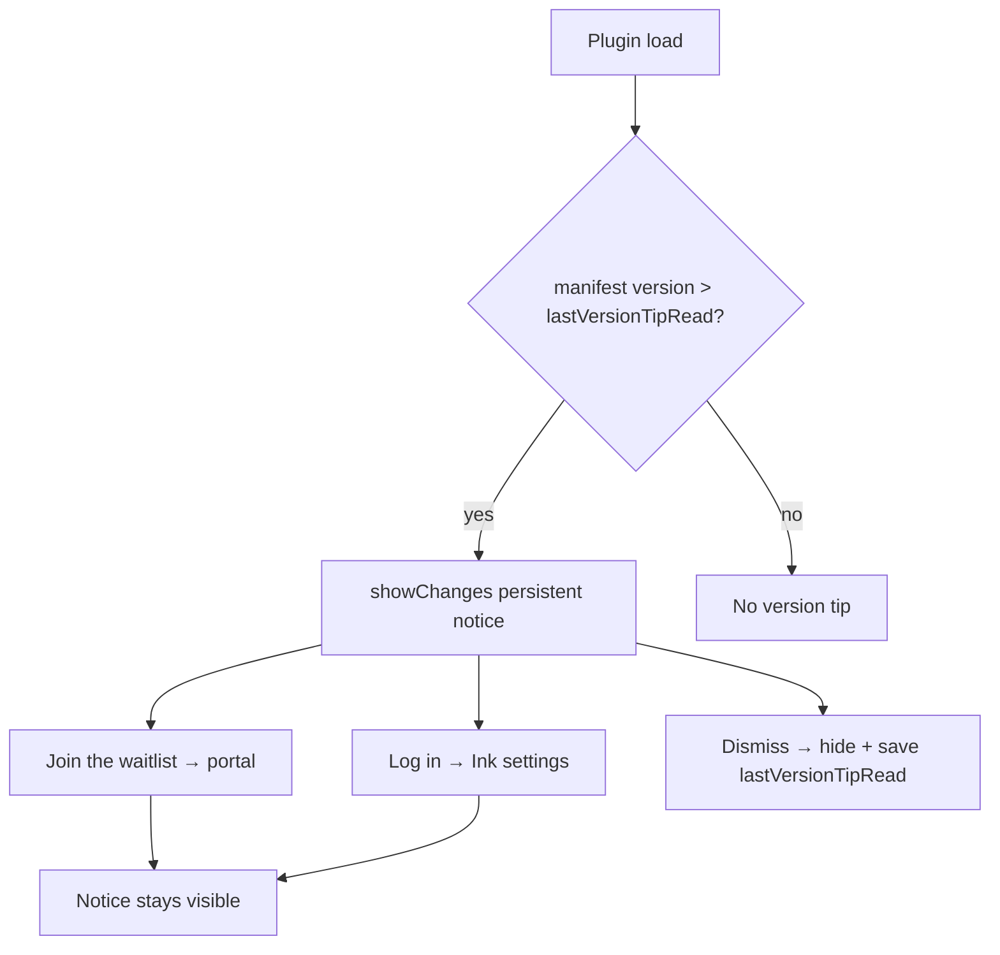

# Version and welcome notices

## Why it exists

Ink uses persistent Obsidian notices for first-run onboarding (`welcome-notice.ts`) and for “what’s new” after a plugin upgrade (`version-notices.ts`). Both share `notice-components.ts` so scroll layout, footer CTAs, and pointer handling stay consistent. Version tips gate on vault-synced `onboardingTips.lastVersionTipRead` in `data.json`; welcome tips use `welcomeTipRead`.

---

## Conceptual understanding

**Welcome flow** — Multi-page carousel on first load when `welcomeTipRead` is false. Footer **Read now** / **Remind me later**; completing or dismissing sets `welcomeTipRead`.

**Version flow** — Single-page **Changes in Ink v…** notice when the installed manifest version is newer than `lastVersionTipRead` (semver compare; `-beta` suffix stripped). **Dismiss** hides the notice and writes `lastVersionTipRead` to the current manifest version. `showRecentChanges()` always shows the current page for manual QA (command/settings entry).

**v0.6 page (handwriting OCR)** — Promotes handwriting transcription and Almost Useful sign-in:

| Element | Behaviour |
|---------|-----------|
| **h2** | `Handwriting transcriptions (OCR)` |
| Body | Invite-only copy; only the product name **Almost Useful** is `<strong>` |
| **Join the waitlist** | Opens `https://account.almostuseful.xyz` in the system browser (`openAlmostUsefulBrowserUrl`) |
| **Log in** | Opens Ink settings (`openInkSettingsTab`) so the user can **Link account** |
| **View feature demos** | Footer link to YouTube (unchanged pattern) |
| **Dismiss** | Hides notice and marks version tip read |

Body primary CTAs sit in a horizontal **`createNoticeBodyCtaRow`** flex row (not the footer bar) so two buttons appear side by side with wrap on narrow widths.

**Interaction rule:** Body CTAs (**Join the waitlist**, **Log in**) do **not** call `notice.hide()`. Obsidian often backgrounds for the browser or settings; keeping the notice visible lets the user read the invite copy again after returning. Only **Dismiss** clears the tip.

---

## Technical details

| Piece | Location |
|-------|----------|
| Version gate + v0.6 copy | `version-notices.ts` — `showVersionNotice`, `showChanges` |
| Welcome carousel | `welcome-notice.ts` |
| Template, footer bar, body CTA row | `notice-components.ts`, `notice-components.scss` |
| Persistence | `PluginSettings.onboardingTips.lastVersionTipRead` (vault `data.json`) |
| QA pre-seed | `qa-test-vault/generate.mjs` sets `lastVersionTipRead` so `open-qa` skips the popup |

**Notice helpers**

- `createNoticeBodyCtaRow(scrollAreaEl)` — `.ddc_ink_notice-body-cta-row` flex container in scroll content.
- `createNoticeBodyCtaButton(parentEl, label)` — primary button inside that row (replaces the old one-button-per-wrapper API).

---

## Technical Gotchas

- **Do not dismiss on body CTA click** — Restoring `notice.hide()` on waitlist/login regresses the post-browser return UX; users lose the invite-only reminder mid-flow.
- **`showRecentChanges` bypasses semver** — Useful for settings “Recent changes”; does not update `lastVersionTipRead` unless the user clicks **Dismiss**.
- **Beta suffix** — `showVersionNotice` strips `-beta` before semver compare so beta builds still match the release tip version string.
- **`manifest.version` must be valid semver** — `showVersionNotice` calls `semVer.gt` on the current version during onload. `semver` throws `Invalid Version` for a two-part string such as `0.6`. That throw fails plugin load (`Plugin failure: ink`). Use three numeric parts (`0.6.0`). `semVer.valid` is only applied to `lastVersionTipRead`, so a bad current version is not skipped. The notice heading `Changes in Ink v0.6` is display copy and is not the string passed to `semver`.
- **Footer vs body CTAs** — Footer uses `createNoticeCtaBar` (primary/tertiary + links); scroll-body actions use the body CTA row so multiple primaries can sit on one line.
