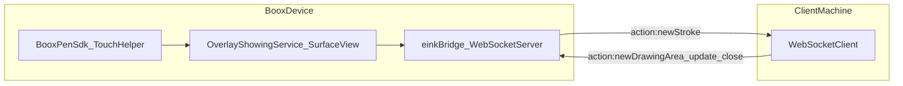

# WebSocket protocol: programmatic strokes (eInk Bridge)

## Why it exists

`eink-bridge` runs a WebSocket server on Boox eInk devices to capture stylus input with low latency (via the Boox Pen SDK) and stream that input to a client (e.g. Obsidian Ink running on a laptop). This document defines the message shapes and flow so clients can interoperate reliably.

## Conceptual understanding

- **Server**: `eink-bridge` (Boox device) hosts a WebSocket endpoint at `ws://<host>:8080/ws` (default).
- **Client**: a client app connects to the server to:
  - define/adjust the drawing area shown on the Boox device
  - receive pen strokes as they are captured

## Flows



## Technical details

### Connection

- **Endpoint**: `ws://<device-ip>:8080/ws`
- **Default bind**: `0.0.0.0` (network-wide) or `127.0.0.1` (localhost-only) depending on the `eink-bridge` setting.
- **Transport**: plain `ws://` (no TLS); see `eink-bridge/docs/implementations/websocket-security.md`.

### Message format

All messages are JSON objects with:

- `action`: string
- `data`: payload (object/array), shape depends on `action`

### Client → server messages

#### `init`

Used as a basic handshake / presence signal.

```json
{
  "action": "init",
  "data": {}
}
```

#### `new-drawing-area` / `update-drawing-area`

Creates or updates the on-device overlay drawing area. The payload is `InputWindowProps`, used by `OverlayShowingService` to size/position the overlay and scale coordinates.

```json
{
  "action": "new-drawing-area",
  "data": {
    "appWidth": 1200,
    "appHeight": 800,
    "x": 100,
    "y": 120,
    "canvasWidth": 1200,
    "canvasHeight": 800
  }
}
```

The `update-drawing-area` message uses the same payload shape.

#### `close-drawing-area`

Closes the overlay drawing area and stops capturing strokes to that region.

```json
{
  "action": "close-drawing-area",
  "data": {}
}
```

### Server → client messages

#### `new-stroke`

Broadcast whenever a completed stroke is received by the Boox SDK. Payload is a list of Boox `TouchPoint` values.

```json
{
  "action": "new-stroke",
  "data": [
    {
      "x": 123.4,
      "y": 567.8,
      "pressure": 0.42,
      "timestamp": 1710000000000
    }
  ]
}
```

Notes:

- The actual `TouchPoint` structure is defined by the Boox SDK (`com.onyx.android.sdk.data.note.TouchPoint`) and may include additional fields (e.g. size, tilt, etc.).
- Strokes are **scaled to client coordinates** before being broadcast (see `OverlayShowingService.createNewStroke` and `scaleDeviceOverlayCoordsToClientCanvas`).

## Technical gotchas

1. **Coordinate scaling is mandatory**: the Boox overlay and the client canvas can have different dimensions; `eink-bridge` scales points before sending, but clients must still treat coordinates as belonging to the client canvas space defined by `InputWindowProps`.
2. **Security model**: by default the WebSocket server may be reachable across the local network with no authentication. Do not assume only trusted clients can connect.
3. **Message parsing**: on the server, `data` is parsed from `Any` using Gson re-serialization (`asInputWindowProps`). Clients should send `InputWindowProps` with correct types (numbers as numbers, not strings).

