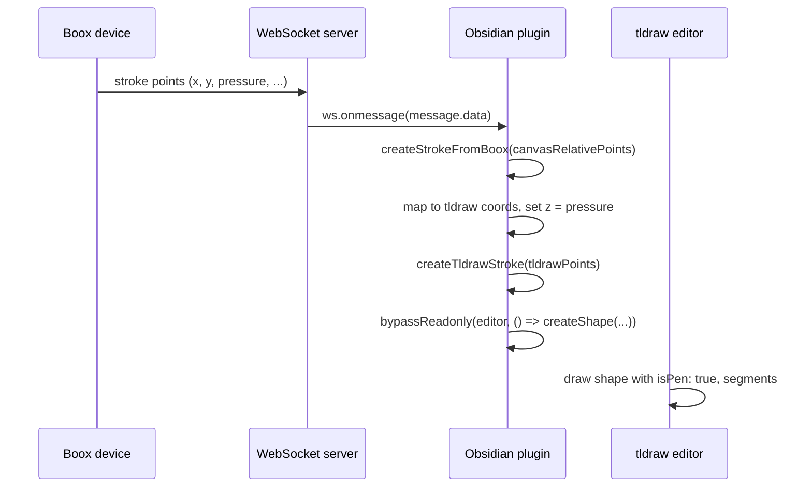

# Programmatic Pen Strokes via WebSocket

This document describes how pen strokes are created programmatically when drawing input comes from an external device (e.g. Boox) over a WebSocket, rather than from direct pointer events on the tldraw canvas. For the WebSocket protocol (message shapes, endpoint, client/server messages), see **eink-bridge** documentation (`eink-bridge/docs/`).

## Overview

When the Boox WebSocket is connected, the device sends stroke point data over the wire. The plugin receives these points, converts them into tldraw’s coordinate system, and creates draw shapes via the editor API. To avoid duplicate strokes, tldraw is put into readonly mode so it ignores local pointer/pen input; only the WebSocket path creates strokes.

## Data Flow

1. **WebSocket message**  
   The connection is set up in `src/connections/local-websocket/local-websocket.ts`. On each message, `message.data` is passed to the `onStrokePoints` callback registered by the drawing editor.

2. **Callback**  
   The drawing editor passes `createStrokeFromBoox` as `onStrokePoints` when connecting (see `tldraw-drawing-editor.tsx`). So each WebSocket payload is a single stroke’s worth of points.

3. **Coordinate conversion**  
   `createStrokeFromBoox` receives points in **canvas-relative** coordinates (relative to the embed/canvas element). It uses the editor’s viewport page bounds and the embed’s bounding rect to scale and translate into **tldraw page coordinates**, so strokes appear in the correct place on the canvas.

4. **Programmatic shape creation**  
   The converted points are passed to `createTldrawStroke`, which calls `editor.createShape()` with `type: 'draw'` and a single `free` segment. Because the editor is in readonly mode while the WebSocket is connected, the call is wrapped in `bypassReadonly()` so this programmatic creation is allowed.

## Stroke Point Properties from the WebSocket

The WebSocket sends points with at least the following properties (see `canvasRelativeStrokePoint` in `tldraw-drawing-editor.tsx`):

| Property   | Description |
|----------|-------------|
| `x`, `y`  | Position in canvas-relative coordinates. |
| `pressure` | Pen pressure, **pre-normalised to [0, 1]** by the sender. |
| `size`   | Reported size (e.g. nib size). Not yet passed into tldraw. |
| `tiltX`, `tiltY` | Tilt angles. Not yet passed into tldraw. |
| `timestamp` | Time of the point. Not yet passed into tldraw. |

Only a subset is currently used when building tldraw points:

- **Position:** `x`, `y` are transformed into tldraw page space (see above).
- **Pressure:** `pressure` is assigned to the point’s **`z`** value. In tldraw, `z` on draw segment points is used for pressure when **`isPen: true`** is set on the draw shape. So the pre-normalised [0, 1] pressure from the WebSocket is applied directly as `z` for variable stroke thickness.

Other fields (`size`, `tiltX`, `tiltY`, `timestamp`) are available in the interface but not yet mapped into the tldraw shape; they could be used in future for richer rendering or replay.

## Relevant Code

- **WebSocket connection and message dispatch:** `src/connections/local-websocket/local-websocket.ts`  
  `connectWebSocket({ onStrokePoints })` and `ws.onmessage` → `props.onStrokePoints(message.data)`.

- **Stroke handling and coordinate conversion:** `src/components/formats/current/drawing/tldraw-drawing-editor/tldraw-drawing-editor.tsx`  
  `createStrokeFromBoox`, `createTldrawStroke`, and the `bypassReadonly` wrapper.

- **Readonly and bypass helpers:** `src/components/formats/current/utils/tldraw-helpers.ts`  
  `lockTldrawInput`, `unlockTldrawInput`, `bypassReadonly`.

When the WebSocket connects, the editor is locked with `lockTldrawInput` so only this programmatic path creates strokes; when it disconnects, `unlockTldrawInput` restores normal pointer input.
