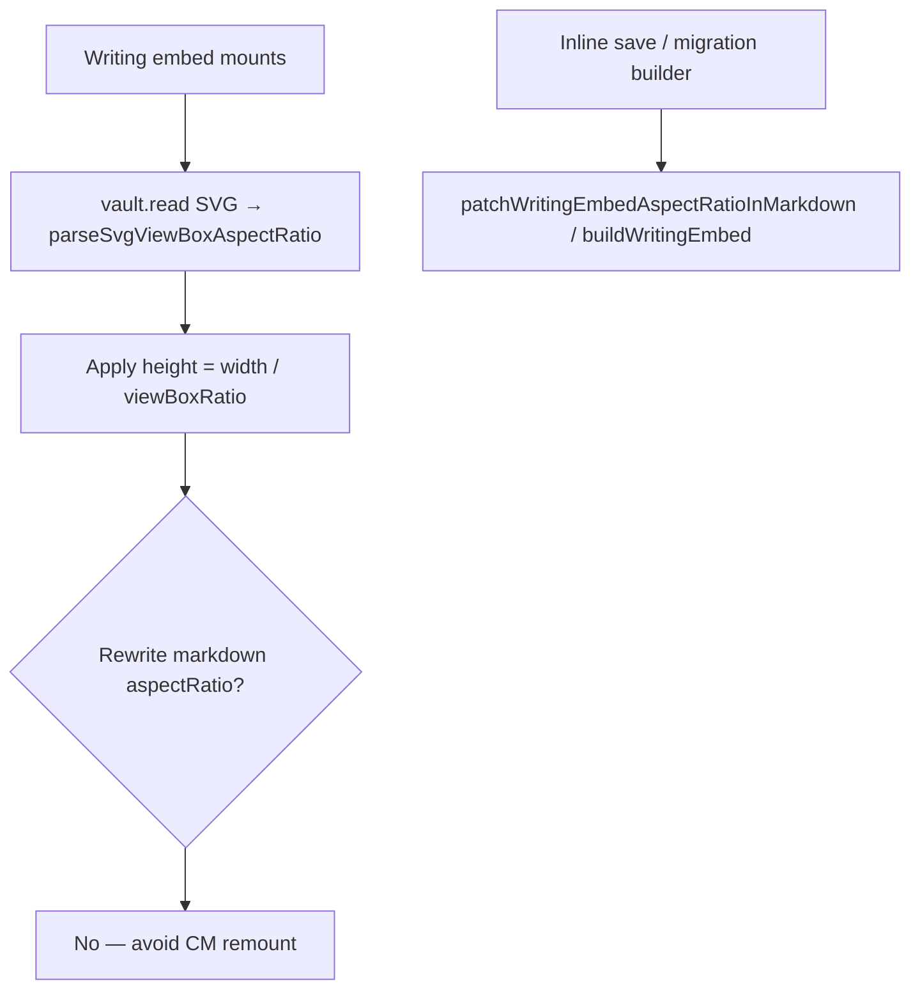

# Writing embed aspect ratio

**Why it exists:** Writing embed height in Live Preview and Reading mode is driven by an `aspectRatio` URL param on the Edit Writing link, but the **SVG root `viewBox`** is the true page size after dedicated-view edits or migration. If the note URL stays stale, embeds look too short/tall until something rewrites markdown. Sizing must follow the SVG without remounting the note on every open.

## Conceptual understanding

Two sources of truth:

| Source | Role |
|--------|------|
| SVG `<svg viewBox="…">` | Authoritative page width÷height after export / migration |
| Edit link `aspectRatio=` | Cached CSS height for embeds; kept in sync when we know it is safe |

Live Preview and Reading mode **size the container from the SVG viewBox** when the file is available. They must **not** rewrite the note’s markdown on mount: mount-time `setEmbedProps` / `vault.modify` remounted CodeMirror widgets and could block notes from opening on the first click.

Markdown `aspectRatio` is healed when builders insert/update embeds (migration, convert, insert, copy) or when the user saves from inline edit (`saveAndSwitchToPreviewMode` → `setEmbedProps`).

## Flows

Helpers: [`writing-embed-aspect-ratio.ts`](../src/logic/utils/writing-embed-aspect-ratio.ts) (`parseSvgViewBoxAspectRatio`, `aspectRatiosMatch`, `patchWritingEmbedAspectRatioInMarkdown`).

## Technical details

- Comparison uses `formatEmbedAspectRatio` so float noise does not thrash URL writes.
- `buildWritingEmbed(Line)` accepts an optional aspect ratio when the converter already knows the page size.
- Drawing embeds still use Edit-link width / viewBox crop for framing; this page is writing-height only.

## Technical Gotchas

- **Never heal `aspectRatio` on writing-embed mount.** Display from viewBox; persist URL only on intentional write paths.
- Metadata JSON does not store aspect ratio — always parse the SVG viewBox.
- After bulk migration, if a note still shows wrong height, confirm the SVG viewBox was rewritten and that the embed is not stuck on a stale in-memory URL until the next save/builder pass.
