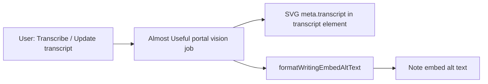

# Writing transcription

**Why it exists:** Handwriting in writing files can be turned into searchable, copyable text. The plugin stores the **full markdown transcript** on the ink SVG attachment and a **stripped plain-text cousin** in the note's image embed alt so Live Preview and the CM6 widget stay stable.

Transcription is powered by the Almost Useful account portal (`POST /api/jobs/handwriting-transcription`). Ink never calls OpenRouter directly.

## Conceptual understanding

Two representations serve different jobs:

| Location | Content | Purpose |
|----------|---------|---------|
| SVG `<metadata><transcript>…</transcript>` | Full markdown (newlines, links, emphasis) | Canonical transcript on the attachment; survives without the note |
| `` image alt | Single-line plain text | Visible in the note; must not break `` or Obsidian `alt\|width` sizing |

The embed alt is **not** a second source of truth for markdown — it is a display-safe summary derived from the SVG transcript via [`formatWritingEmbedAltText`](../src/components/formats/current/utils/build-embeds.ts).



## User flow (current format only)

Transcription is **manual** — there is no automatic transcribe on preview or lock.

1. Sign in to Almost Useful in Ink settings (app token required).
2. Open a **writing** file in the embed editor or dedicated writing view.
3. Open the overflow menu (⋯).
4. Choose **Transcribe** (no transcript yet) or **Update transcript** (transcript already on the file).
5. The plugin calls [`transcribeWriting`](../src/logic/transcribe-writing.ts), saves the result to the SVG, then:
   - **Embed context:** also patches the markdown image alt in the note via [`updateEmbedTranscript`](../src/components/formats/current/writing/writing-embed-extension/writing-embed-extension.tsx).
   - **Dedicated view:** SVG only (no note alt to update).

Drawing files and v1 `.writing` code-block embeds are out of scope.

```mermaid
sequenceDiagram
  participant UI as Writing editor overflow menu
  participant TW as transcribeWriting
  participant Prep as prepareProductionHandwritingTranscriptionMedia
  participant Portal as POST /api/jobs/handwriting-transcription
  participant Save as completeSave / buildFileStr
  participant Vault as Vault SVG file
  participant CM6 as writing-embed-extension
  participant Note as Markdown note

  UI->>TW: handleTranscribe (current canvas SVG)
  TW->>Prep: strip metadata + theme-aware page
  Prep->>Portal: visual SVG base64 + gemini-2.5-flash-lite
  Portal-->>TW: text
  TW-->>UI: transcript string
  UI->>Save: transcriptRef + ink save
  Save->>Vault: modify SVG with transcript element
  alt embed context
    UI->>CM6: onTranscriptSaved
    CM6->>Note: patch ![alt] in embed snippet
  end
```

## Portal integration (production)

| Setting | Value |
|---------|--------|
| Route | `POST /api/jobs/handwriting-transcription` |
| Auth | Almost Useful app token (`ink` / `Ink` attribution) |
| Model | `google/gemini-2.5-flash-lite` |
| Media | Visual-only SVG (`<metadata>` stripped) |
| Page background | Theme-aware opaque rect — white for dark ink, black for light ink (inferred from `ink-color-primary` stroke fills) |

Implementation:

- [`transcribeWriting`](../src/logic/transcribe-writing.ts) — production entry point
- [`prepareProductionHandwritingTranscriptionMedia`](../src/logic/handwriting-transcription-variants.ts) — delegates to the same SVG prep as eval `svg-gemini-flash-lite`
- [`postHandwritingTranscriptionJob`](../src/logic/almostuseful/almostuseful-handwriting-transcription.ts) — HTTP client

Errors surface as Obsidian notices: not signed in (`402` insufficient credits, portal error messages).

Eval matrix and live tests remain in the repo for model comparison — not exposed in the UI. See [Eval and live tests](#eval-and-live-tests).

ClickUp decision log (routes, cost table): [Portal AI job routes](https://app.clickup.com/36639212/docs/12y4fc-6596/12y4fc-7656) · Ink summary: [Handwriting transcription](https://app.clickup.com/36639212/docs/12y4fc-7576/12y4fc-7676).

## SVG storage: `<transcript>` element

Full markdown is written as a sibling of `<ink>` inside `<metadata>`:

```xml
<metadata>
  <ink plugin-version="…" file-type="inkWriting" …/>
  <transcript>**bold**

[line](https://example.com)</transcript>
  <ink-canvas version="…">…</ink-canvas>
</metadata>
```

- Emitted only when `meta.transcript` is non-empty.
- Text is XML-escaped (`&`, `<`, `>`) via `escapeXmlText` — **not** CDATA.
- The legacy `transcript="…"` attribute on `<ink>` is **no longer written**; [`readInkTranscript`](../src/logic/utils/extractInkJsonFromSvg.ts) still reads it for files saved during the brief attribute experiment.

**Save paths:**

| Engine | Builder | Transcript insertion |
|--------|---------|-------------------|
| ink-canvas | [`buildInkCanvasFileStr`](../src/components/formats/current/utils/buildFileStr.ts) | Included in the metadata string splice (no whole-file formatter) |
| legacy tldraw | [`buildTldrawFileStr`](../src/components/formats/current/utils/buildFileStr.ts) | Spliced **after** `xml-formatter` so pretty-print does not inject whitespace into markdown body text |

[`saveWriteFileTranscript`](../src/components/formats/current/utils/needsTranscriptUpdate.ts) updates transcript only (preserves file `mtime` so the change does not look like a stroke edit).

## Embed alt stripping

[`formatWritingEmbedAltText`](../src/components/formats/current/utils/build-embeds.ts) rules:

1. Missing or empty after processing → `InkWriting` placeholder.
2. CR/LF/tabs → spaces; collapse runs of whitespace.
3. Remove `[` `]` `\` `|` `<` `>` (break or hijack the image token / Obsidian sizing).
4. Keep `*`, `_`, `~`, `(`, `)` — they do not terminate the alt.

Used by [`buildWritingEmbedLine`](../src/components/formats/current/utils/build-embeds.ts) and [`patchWritingEmbedTranscriptInEmbedSnippet`](../src/components/formats/current/utils/build-embeds.ts).

## Editor lifecycle: `transcriptRef`

The writing editor keeps `transcriptRef` so routine stroke autosaves do not drop a transcript that was loaded or saved earlier in the session. [`buildInkCanvasWritingFileData`](../src/components/formats/current/utils/build-file-data.ts) passes `transcript` into `meta` on each save.

`handleTranscribe` builds the current canvas SVG (including unsaved strokes) before calling the portal, then saves transcript + strokes together.

## Eval and live tests

Fixtures: `tests/fixtures/handwriting-transcription/` (three real writing SVGs + expected transcripts).

Eval matrix: 5 models × 2 media (SVG / PNG) = 10 variants via [`transcribeHandwritingVariant`](../src/logic/handwriting-transcription-variants.ts). Live auth defaults to the `testing` OAuth client (not production `ink`).

```bash
HANDWRITING_TRANSCRIPTION_LIVE=1 npm run test:unit -- tests/logic/handwriting-transcription-live.test.ts
```

PNG raster eval uses `@napi-rs/canvas` in Node (dev dependency only — not bundled into the plugin). Regenerate fixture PNGs: `npx tsx tests/fixtures/handwriting-transcription/render-eval-pngs.ts`.

## Technical gotchas

- **Do not store full markdown in the embed alt.** Newlines and `[` `]` break Obsidian image syntax and the CM6 embed widget regex.
- **Do not put transcript on an `<ink>` attribute.** XML attribute normalization collapses newlines; use the `<transcript>` element.
- **Tldraw saves and `xml-formatter`.** If `<transcript>` is inside the block passed to the formatter, indent whitespace can corrupt markdown. The tldraw path inserts the compact element after formatting.
- **Send visual SVG with opaque page to the portal.** Raw metadata JSON wastes tokens; transparent SVG backgrounds caused Gemini to return numbered-list junk instead of transcribing. Theme-aware page contrast matches eval findings.
- **Production uses SVG only.** PNG rasterization exists for eval variants, not the shipped Transcribe menu.
- **Auto-transcribe is off.** [`needsTranscriptUpdate`](../src/components/formats/current/utils/needsTranscriptUpdate.ts) always returns `false`; [`fetchTranscriptIfNeeded`](../src/components/formats/current/utils/fetchTranscript.ts) is dormant until product enables it.
- **Re-save to migrate.** Files that still have `transcript="…"` on `<ink>` load correctly; the next transcribe or transcript save rewrites the `<transcript>` element.
- **Transcript is not rendered as markdown in the note UI** — only stored and reflected as plain alt text.
- **Sign-in required.** Transcription debits Pool A credits through the portal; unsigned users get an error notice.

## Related docs

- [Almost Useful account (Ink settings)](almostuseful-account.md) — login and credit charts
- [File format and conversion](file-format-and-conversion.md) — overall SVG metadata layout
- [Plugin memory and persistence](plugin-memory-and-persistence.md) — vault files vs settings
