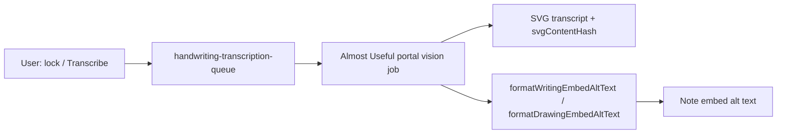
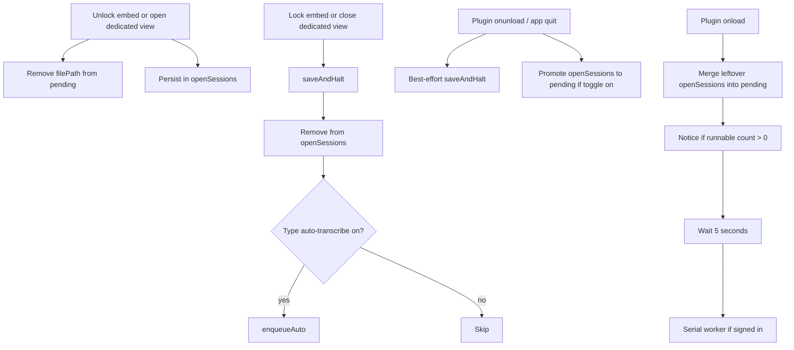
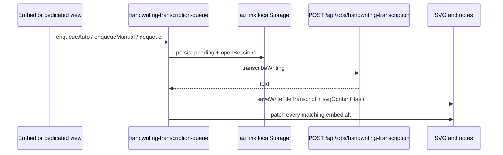

# Handwriting transcription (writing and drawing)

**Why it exists:** Handwriting in current-format **writing and drawing** SVG files can be turned into searchable, copyable text. The plugin stores the **full markdown transcript** on the ink SVG attachment and a **stripped plain-text cousin** in the note's image embed alt so Live Preview and the CM6 widget stay stable.

Transcription is powered by the Almost Useful account portal (`POST /api/jobs/handwriting-transcription`). Ink never calls OpenRouter directly.

Jobs run through a **plugin-owned serial queue** so transcription survives embed unmount, note close, and Obsidian quit — not React or CodeMirror widget lifetime.

## Conceptual understanding

Two representations serve different jobs:

| Location | Content | Purpose |
|----------|---------|---------|
| SVG `<metadata><transcript>…</transcript>` | Full markdown (newlines, links, emphasis) | Canonical transcript on the attachment; survives without the note |
| `` image alt | Single-line plain text | Visible in the note; must not break `` or Obsidian `alt\|width` sizing |
| `<ink svg-content-hash="…" svg-content-hashed-at="…"/>` | SimHash of stroke geometry + ISO timestamp | Fingerprint ink at last successful transcription; used to skip redundant auto jobs (not a hash of transcript text) |

The embed alt is **not** a second source of truth for markdown — it is a display-safe summary derived from the SVG transcript via [`formatWritingEmbedAltText`](../src/components/formats/current/utils/build-embeds.ts) or [`formatDrawingEmbedAltText`](../src/components/formats/current/utils/build-embeds.ts).



## User flows

### Manual Transcribe (always available)

1. Sign in to Almost Useful in Ink settings (app token required).
2. Open a **writing or drawing** file in the embed editor or dedicated view.
3. Open the overflow menu (⋯).
4. Choose **Transcribe** (no transcript yet) or **Update transcript** (transcript already on the file).
5. The job is enqueued as **manual** (jumps the waiting list; not gated by auto-transcribe toggles).

Manual jobs use the **live canvas** SVG (including unsaved strokes) when enqueued from the editor overflow menu.

### Auto-transcribe on close (vault-synced toggles)

Settings → **Writing** / **Drawing** → **Transcribe handwriting when closing**:

| Setting | Default | Scope |
|---------|---------|--------|
| `writingAutoTranscribeOnClose` | **on** | Writing embed lock, dedicated writing view close, quit-as-lock |
| `drawingAutoTranscribeOnClose` | **off** | Drawing embed lock, dedicated drawing view close, quit-as-lock |

Auto enqueue runs only when the per-type toggle is on. Turning a toggle **off** drops **waiting auto** jobs of that type from the device-local queue; it does **not** cancel an in-flight portal POST. Manual pending jobs stay.

**Not auto-enqueued:** expand embed → dedicated view (save on expand, dequeue when dedicated editor opens), empty canvas, or when stroke SimHash matches the file's stored `svgContentHash` (Hamming distance 0).

### Queue lifecycle



- **One serial worker** for both file types, unique by file path.
- **Manual** jobs sit at the front of **waiting**; never abort an in-flight POST.
- **Launch resume:** after merge/prune, if runnable jobs remain, Obsidian shows e.g. `Resuming handwriting transcription (3 files)`, waits **5 seconds**, then kicks. Unlock/open during grace still **dequeues** that file.
- **Not signed in:** pending jobs stay until sign-in (`ALMOSTUSEFUL_SESSION_CHANGED_EVENT` kicks the worker).

Drawing files and v1 code-block embeds remain out of scope for the queue UI paths.



## Portal integration (production)

| Setting | Value |
|---------|--------|
| Route | `POST /api/jobs/handwriting-transcription` |
| Auth | Almost Useful app token (`ink` / `Ink` attribution) |
| Model | `google/gemini-2.5-flash-lite` |
| Media | Visual-only SVG (`<metadata>` stripped) |
| Page background | Theme-aware opaque rect — white for dark ink, black for light ink (inferred from `ink-color-primary` stroke fills) |

Implementation:

- [`transcribeWriting`](../src/logic/transcribe-writing.ts) — production HTTP entry (full SVG string; used for **both** writing and drawing)
- [`handwriting-transcription-queue.ts`](../src/logic/handwriting-transcription-queue.ts) — serial worker, enqueue/dequeue, launch grace, quit promote
- [`handwriting-transcription-apply.ts`](../src/logic/handwriting-transcription-apply.ts) — vault-wide embed alt patch (open editor or `vault.process`)
- [`postHandwritingTranscriptionJob`](../src/logic/almostuseful/almostuseful-handwriting-transcription.ts) — HTTP client

Errors surface as Obsidian notices: not signed in, `402` insufficient credits, portal error messages.

Eval matrix and live tests remain in the repo for model comparison — not exposed in the UI. See [Eval and live tests](#eval-and-live-tests).

ClickUp decision log (routes, cost table): [Portal AI job routes](https://app.clickup.com/36639212/docs/12y4fc-6596/12y4fc-7656) · Ink summary: [Handwriting transcription](https://app.clickup.com/36639212/docs/12y4fc-7576/12y4fc-7676).

## Queue persistence (device-local only)

**Do not put the pending queue in `data.json`.** A synced job list would double-bill across devices.

| Key | Storage | Content |
|-----|---------|---------|
| `au_ink_handwritingTranscriptionQueue_v1` | `localStorage` via [`storage.ts`](../src/logic/utils/storage.ts) | `pending[]` + `openSessions[]` |

Pending job fields: `filePath`, `fileType` (`inkWriting` \| `inkDrawing`), `reason` (`auto` \| `manual`), `svgContentHash`, `enqueuedAt`.

See [Plugin memory and persistence](plugin-memory-and-persistence.md).

Auto-transcribe **preferences** (`writingAutoTranscribeOnClose`, `drawingAutoTranscribeOnClose`) **do** live in vault-synced `data.json` — they are user preferences, not job state.

## `svgContentHash` (stroke SimHash)

Not SHA-256. A **64-bit SimHash** (Charikar) of quantized stroke geometry from ink-canvas points (and tldraw migration when needed). Stored as `v1:simhash64:<16 hex chars>` on `<ink>`.

- [`computeSvgContentHash`](../src/logic/svg-content-hash.ts) — fingerprint current ink
- [`svgContentHashHammingRatio`](../src/logic/svg-content-hash.ts) — fraction of bits different (`0` = identical layout for auto skip today)
- `svgContentHashedAt` — ISO-8601 written on successful apply; diagnostic only, not used for similarity

Future vault-wide re-transcribe on sync will call the same [`enqueueAuto`](../src/logic/handwriting-transcription-queue.ts) entry and respect `openSessions` as an edit skip list.

## SVG storage: `<transcript>` element

Full markdown is written as a sibling of `<ink>` inside `<metadata>`:

```xml
<metadata>
  <ink plugin-version="…" file-type="inkWriting"
       svg-content-hash="v1:simhash64:…"
       svg-content-hashed-at="2026-03-21T12:00:00.000Z"/>
  <transcript>**bold**

[line](https://example.com)</transcript>
  <ink-canvas version="…">…</ink-canvas>
</metadata>
```

- Emitted only when `meta.transcript` is non-empty.
- Text is XML-escaped (`&`, `<`, `>`) via `escapeXmlText` — **not** CDATA.
- The legacy `transcript="…"` attribute on `<ink>` is **no longer written**; [`readInkTranscript`](../src/logic/utils/extractInkJsonFromSvg.ts) still reads it for files saved during the brief attribute experiment.

**Save paths:**

| Engine | Builder | Transcript insertion |
|--------|---------|-------------------|
| ink-canvas | [`buildInkCanvasFileStr`](../src/components/formats/current/utils/buildFileStr.ts) | Included in the metadata string splice (no whole-file formatter) |
| legacy tldraw | [`buildTldrawFileStr`](../src/components/formats/current/utils/buildFileStr.ts) | Spliced **after** `xml-formatter` so pretty-print does not inject whitespace into markdown body text |

[`saveWriteFileTranscript`](../src/components/formats/current/utils/needsTranscriptUpdate.ts) updates transcript and optional hash fields (preserves file `mtime` so the change does not look like a stroke edit).

## Embed alt stripping

[`formatWritingEmbedAltText`](../src/components/formats/current/utils/build-embeds.ts) / [`formatDrawingEmbedAltText`](../src/components/formats/current/utils/build-embeds.ts) rules:

1. Missing or empty after processing → `InkWriting` / `InkDrawing` placeholder.
2. CR/LF/tabs → spaces; collapse runs of whitespace.
3. Remove `[` `]` `\` `|` `<` `>` (break or hijack the image token / Obsidian sizing).
4. Keep `*`, `_`, `~`, `(`, `)` — they do not terminate the alt.

Vault-wide alt patch: [`patchInkEmbedTranscriptAltsInVault`](../src/logic/handwriting-transcription-apply.ts) matches `` plus `type=inkWriting` or `type=inkDrawing` in the edit URL.

## Editor lifecycle: session registry

While an embed is unlocked or a dedicated view is open, [`registerTranscriptionEditorSession`](../src/logic/handwriting-transcription-queue.ts) registers `saveAndHalt` by file path (refcount if the same SVG is open in two places), **dequeues** pending work for that path, and persists `openSessions`.

Editors keep `transcriptRef` (and hash refs) so routine stroke autosaves do not drop transcript metadata loaded earlier in the session. [`buildInkCanvasWritingFileData`](../src/components/formats/current/utils/build-file-data.ts) / [`buildInkCanvasDrawingFileData`](../src/components/formats/current/utils/build-file-data.ts) pass transcript + hash fields on each save.

On successful queue apply, `onTranscriptApplied` updates editor refs and embed widgets patch note alts via `updateEmbedTranscript` on the CM6 extension.

## Eval and live tests

Fixtures: `tests/fixtures/handwriting-transcription/` (three real writing SVGs + expected transcripts).

Eval matrix: 5 models × 2 media (SVG / PNG) = 10 variants via [`transcribeHandwritingVariant`](../src/logic/handwriting-transcription-variants.ts). Live auth defaults to the `testing` OAuth client (not production `ink`).

```bash
HANDWRITING_TRANSCRIPTION_LIVE=1 npm run test:unit -- tests/logic/handwriting-transcription-live.test.ts
```

PNG raster eval uses `@napi-rs/canvas` in Node (dev dependency only — not bundled into the plugin). Regenerate fixture PNGs: `npx tsx tests/fixtures/handwriting-transcription/render-eval-pngs.ts`.

## Technical gotchas

- **Do not store full markdown in the embed alt.** Newlines and `[` `]` break Obsidian image syntax and the CM6 embed widget regex.
- **Do not put transcript on an `<ink>` attribute.** XML attribute normalization collapses newlines; use the `<transcript>` element.
- **Do not put the job queue in `data.json`.** Device-local only — avoids multi-device double billing.
- **Tldraw saves and `xml-formatter`.** If `<transcript>` is inside the block passed to the formatter, indent whitespace can corrupt markdown. The tldraw path inserts the compact element after formatting.
- **Send visual SVG with opaque page to the portal.** Raw metadata JSON wastes tokens; transparent SVG backgrounds caused Gemini to return numbered-list junk instead of transcribing. Theme-aware page contrast matches eval findings.
- **Production uses SVG only.** PNG rasterization exists for eval variants, not the shipped Transcribe menu.
- **Auto skip uses Hamming 0 only today.** The distance helper exists for a future non-zero “changed enough” threshold; [`needsTranscriptUpdate`](../src/components/formats/current/utils/needsTranscriptUpdate.ts) still returns `false` — do not revive dormant React `fetchTranscriptIfNeeded` effects.
- **Quit may miss the last unsaved stroke.** Transcribe what is on disk after best-effort `saveAndHalt`.
- **Expand-to-dedicated does not auto-enqueue.** Dedicated registration dequeues; user continues editing the same file.
- **Re-save to migrate.** Files that still have `transcript="…"` on `<ink>` load correctly; the next transcribe or transcript save rewrites the `<transcript>` element.
- **Transcript is not rendered as markdown in the note UI** — only stored and reflected as plain alt text.
- **Sign-in required.** Transcription debits Pool A credits through the portal; unsigned users keep pending until sign-in.

## Related docs

- [Almost Useful account (Ink settings)](almostuseful-account.md) — login and credit charts
- [File format and conversion](file-format-and-conversion.md) — overall SVG metadata layout
- [Plugin memory and persistence](plugin-memory-and-persistence.md) — vault files vs settings vs queue
